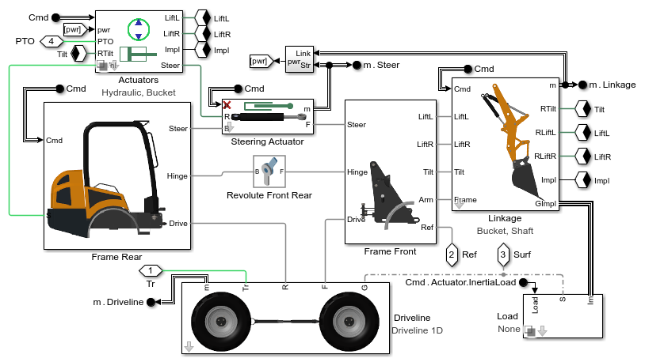

# **Wheel Loader Design with Simscape&trade;**
This repository contains models and code to help engineers model and simulate 
wheel loaders. A set of examples shows how to design a power-split hydromechanical
CVT (continuously variable transmission), test driveline designs, and determine
requirements for linkage actuators.

* **Early-stage physical design** is supported by parameterized models of
the transmission, driveline, and chassis, useful before CAD is ready
* **Design tradeoffs** are explored using optimization algorithms, which
are used to find gear ratios that achieve desired speed ranges
* **Interactive workflows** are shown using MATLAB&reg; Apps to explore designs
* **Integrated testing of physical system and controller** is supported by 
a hydromechanical model of the CVT, powertrain, and linkage.
* **Exploration of electrical technology** is enabled with an electrical CVT model.
* **Surface terrain definition** is shown by extracting point clouds from STL geometry.
* **Tire profile definition** is shown by extracting point clouds from STL geometry.

Open the project file Wheel_Loader_Simscape.prj to get started.

View on File Exchange:   
You can also open in MATLAB Online: 

## **Wheel Loader Animation Clip**

## **Model of Wheel Loader with Configurable Powertrain and Implement**

## **Wheel Loader Subsystems**

## **Wheel Loader Electrical CVT**

## **Wheel Loader Hydrostatic CVT**

## **Wheel Loader Power Split Hydromechanical CVT**

## **Wheel Loader Chassis, Driveline, and Implement**

## **MATLAB App for Exploring CVT Design**

To learn more about modeling and simulation with Simscape, please visit:
* [Simscape Getting Started Resources](https://www.mathworks.com/solutions/physical-modeling/resources.html)
* Product Capabilities:
   * [Simscape&trade;](https://www.mathworks.com/products/simscape.html)
   * [Simscape Battery&trade;](https://www.mathworks.com/products/simscape-battery.html)
   * [Simscape Driveline&trade;](https://www.mathworks.com/products/simscape-driveline.html)
   * [Simscape Electrical&trade;](https://www.mathworks.com/products/simscape-electrical.html)
   * [Simscape Fluids&trade;](https://www.mathworks.com/products/simscape-fluids.html)
   * [Simscape Multibody&trade;](https://www.mathworks.com/products/simscape-multibody.html)

Copyright &copy; 2023 The MathWorks, Inc.
